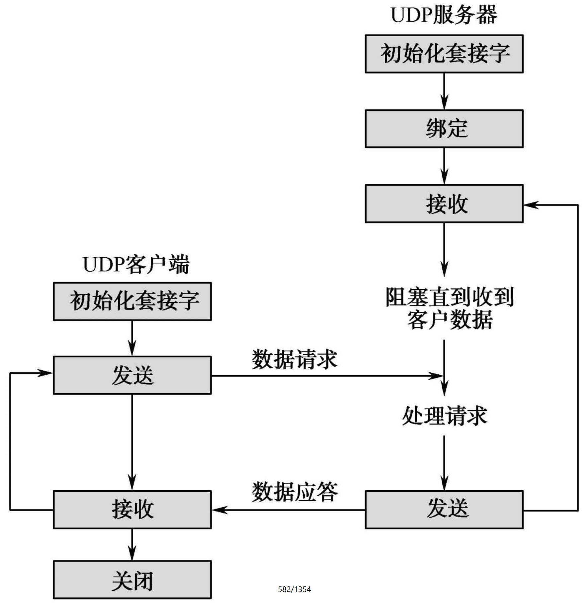

用户数据报协议（User Data Protocol，UDP）是一种简单轻量级、不可靠、面向数据报、无连接的传输层协议，可以应用在可靠性不是十分重要的场合，如短消息、广播信息等。

适合应用的情况有以下几种：

- 网络数据大多为短消息。
- 拥有大量客户端。
- 对数据安全性无特殊要求。
- 网络负担非常重，但对响应速度要求高。

## UDP协议工作原理

如图10.4所示，UDP客户端向UDP服务器发送一定长度的请求报文，报文大小的限制与各系统的协议实现有关，但不得超过其下层IP协议规定的64KB；UDP服务器同样以报文形式作出响应。如果服务器未收到此请求，客户端不会进行重发，因此报文的传输是不可靠的。


## UDP编程模型

下面介绍基于UDP协议的经典编程模型，程序编写的通用流程如图10.5所示。



可以看出，在UDP方式下，客户端并不与服务器建立连接，它只负责调用发送函数向服务器发出数据报。类似地，服务器也不从客户端接收连接，只负责调用接收函数，等待来自某客户端的数据到达。

Qt 中通过 QUdpSocket 类实现 UDP 协议的编程。接下来通过一个实例，介绍如何实现基于 UDP 协议的广播应用，它由 UDP 服务器和 UDP 客户端两部分组成。

```c++

```

```c++

```


## 二级

### 三级

```c++

```

```c++

```


## 二级

### 三级

```c++

```

```c++

```


## 二级

### 三级

```c++

```

```c++

```


## 二级

### 三级

```c++

```

```c++

```


